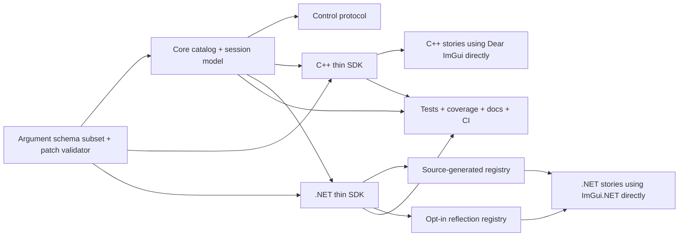

# DearStory core story model architecture

## Purpose

This document captures the second executable DearStory slice: the shared core story model and the thin host SDKs that let native C++ and .NET publish the same catalog/session metadata without introducing a DearStory-owned widget layer.

The slice exists to lock down five things before host orchestration and rendering work expand:

- one canonical story ID model in both languages;
- one merged catalog/session model with deterministic services;
- one schema contract for editable story arguments;
- one thin SDK shape for C++ and .NET story authors;
- one verification surface for docs, coverage, and CI.

## Scope

In scope for this slice:

- native and managed story IDs, descriptors, catalogs, sessions, and deterministic services;
- a documented DearStory JSON Schema subset for argument editing and validation;
- native C++ story registration and registry primitives;
- managed source-generated story registration plus explicit reflection fallback;
- shared vectors, coverage policy, and authoring documentation.

Out of scope for this slice:

- host discovery, process lifetime, file watching, or hot reload;
- a DearStory-owned widget abstraction over Dear ImGui or ImGui.NET;
- executable Markdown Doc Blocks runtime rendering;
- Linux or macOS host/runtime execution.

## Architectural constraints

- DearStory remains Dear ImGui-first and language-neutral.
- Native and managed hosts share contracts, not ABI.
- Story rendering stays inside the host language and binding.
- Reflection in .NET is fallback-only and opt-in.
- Markdown documentation remains Markdown-first, without executable MDX.

## Component map

## Why the SDK stays thin

DearStory is not trying to become a second immediate-mode UI API. The SDK only provides:

- canonical story registration;
- argument schema/default metadata;
- deterministic session state;
- action, log, and target capture surfaces.

Everything visual still happens through the host binding:

- C++ stories call `ImGui::...` directly;
- .NET stories call `ImGuiNET.ImGui...` directly.

That keeps DearStory usable outside the C# ecosystem and avoids locking the catalog contract to one binding surface.

## Story publication model

Each published story has:

- one canonical ID used for matching and merge rules;
- one display title and hierarchy;
- one default argument snapshot;
- one validated argument schema;
- zero or more emitted actions, logs, and interaction targets.

The catalog stores descriptors only. Session state stores mutable argument values plus deterministic clock/random state. Story callbacks receive a session-backed context and emit serializable artifacts for the host and future automation layers.

## Schema boundary

The argument contract is intentionally smaller than full JSON Schema. The current subset exists to support:

- stable cross-language validation;
- schema-driven controls and reflection later;
- deterministic patch acceptance/rejection;
- machine-readable contracts for docs and automation.

Unsupported keywords are rejected explicitly instead of being ignored silently.

## .NET registration strategy

The managed path defaults to source generation because that produces:

- stable startup behavior;
- no runtime assembly scanning requirement;
- compile-time duplicate-ID diagnostics;
- XML-documentation-backed story descriptions.

Reflection fallback exists only behind `ReflectionStoryRegistryOptions.AllowReflectionFallback = true` for scenarios where source generation is not practical.

## Documentation strategy

This slice establishes three documentation inputs:

- Markdown in `docs/` for architecture, policy, and authoring guidance;
- XML comments on public C# APIs;
- Doxygen comments on public C++ APIs.

Markdown Doc Blocks remain part of the approved direction, but runtime rendering of those docs is intentionally deferred until host and catalog UI work starts. In the current slice, schema and story metadata are the canonical machine-readable inputs that future Markdown docs will bind to.

## Verification boundary

The canonical verification path for this slice is:

1. deterministic protocol generation check;
2. Release native and managed build;
3. native, managed, contract, and E2E tests;
4. combined coverage gate for protocol/core/SDK hand-authored code;
5. Doxygen generation with warnings as errors;
6. `git diff --check`.

## Backlog after this slice

- host process orchestration and transport integration on top of the core catalog/session model;
- Markdown Doc Blocks ingestion and rendering;
- catalog UI, controls UI, watch/reload loop, and visual baselines;
- Linux and macOS implementations of the same contracts.
