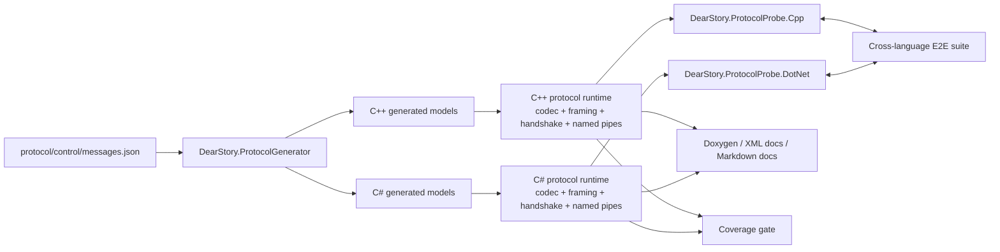

# DearStory protocol bootstrap architecture

## Purpose

This document captures the rationale and structure of the first executable DearStory slice: a cross-language control-protocol bootstrap that proves native C++ and .NET peers can negotiate the same wire contract over Windows named pipes.

The bootstrap exists to lock down three things before host/rendering work starts:

- one language-neutral wire contract;
- one compatibility handshake that both ecosystems obey;
- one conformance harness that prevents silent drift between implementations.

## Scope

In scope for this bootstrap:

- protocol manifest and checked-in generated models;
- native C++ codec, framing, handshake, and Windows named-pipe transport;
- managed .NET codec, framing, handshake, and Windows named-pipe transport;
- native and managed one-shot protocol probes;
- cross-language E2E handshake tests;
- coverage and public API documentation gates.

Out of scope for this bootstrap:

- host rendering and framebuffer transport;
- catalog UI and runner orchestration;
- Linux, macOS, browser, or remote execution;
- story reflection, action schemas, or Markdown Doc Blocks runtime rendering.

## Architectural constraints

- DearStory remains Dear ImGui-first and language-neutral.
- C++ and .NET are isolated hosts, not ABI-sharing components.
- Compatibility happens at the protocol layer only.
- Windows is the only implementation target in this phase.
- Generated models are contracts, not handwritten integration seams.

## Component map

## Why the hosts stay separate

DearStory needs other ecosystems to participate without inheriting C# runtime assumptions or native ABI coupling. The protocol runtime therefore stays intentionally thin and binding-friendly:

- native stories can use Dear ImGui directly;
- managed stories can use ImGui.NET directly;
- both hosts publish the same metadata and speak the same control protocol;
- the catalog stays unified above the transport boundary.

This keeps the SDK contract stable while allowing host-specific rendering and input integration later.

## Handshake responsibilities

The handshake layer owns only compatibility and identity negotiation. It does not:

- create processes;
- open pipes by itself;
- log externally;
- inspect clocks or GUID generators directly.

That separation is deliberate. The handshake is pure policy so that:

- native and managed implementations stay behaviorally equivalent;
- the same contract vectors can be replayed in unit tests;
- host/runtime work later can reuse the same negotiation rules unchanged.

## Transport boundary

Named pipes are the Windows-first transport for the bootstrap because they give:

- process isolation without shared ABI;
- deterministic loopback integration tests;
- clean cancellation and disconnect semantics;
- a transport that can later be swapped without changing the envelope contract.

The transport surface is intentionally framed-payload only. JSON parsing stays above it.

## Conformance strategy

The bootstrap uses three validation layers:

1. unit tests for codec, framing, and handshake behavior;
2. integration tests for managed named-pipe lifecycle behavior;
3. black-box E2E tests using real native and managed probe processes in both directions.

That layering is the main guard against “works in one binding, drifts in another”.

## Coverage scope

Coverage for this bootstrap is intentionally scoped to hand-authored runtime code:

- native: `src/protocol/cpp/src/**/*.cpp`
- managed: hand-authored files in `src/protocol/dotnet/DearStory.Protocol`, excluding generated `*.g.cs`

Generated models and serializer output are validated by regeneration checks and protocol tests, but they do not define the bootstrap coverage floor.

## Backlog after this bootstrap

- host rendering and RGBA frame transport;
- unified catalog/session model;
- Markdown Doc Blocks and schema-driven controls;
- Linux and macOS transport/host support;
- additional language hosts beyond C++ and .NET.
