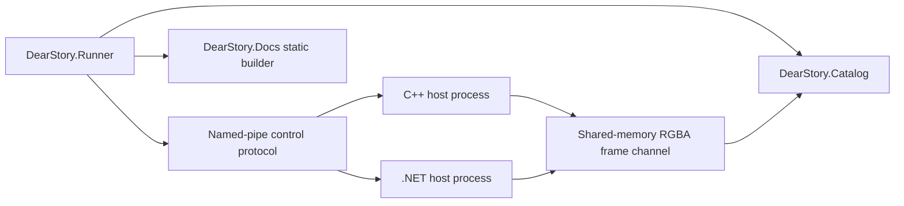

# Windows host baseline architecture

This document captures the first Windows-first vertical slice that layers live
host supervision, RGBA frame transport, and shared documentation contracts on
top of the protocol and core-story-model work already in this branch.

## Scope

This baseline adds:

- one runner-plus-catalog executable on Windows;
- one native C++ host and one managed .NET host as separate processes;
- named-pipe control plus shared-memory RGBA frame transport;
- scaffolding for runner, catalog, docs, transports, and hosts projects.

This baseline does not yet add Linux, macOS, browser execution, D3D11
shared-texture transport, or embedded mode.

## Topology

## Responsibilities

- `DearStory.Runner`: configuration loading, builders, supervision, diagnostics,
  restart policy, and deterministic capture orchestration.
- `DearStory.Catalog`: story tree, preview, schema-driven controls, logs,
  actions, and host-health surfaces.
- `DearStory.Docs`: Markdown, Doc Blocks, autodocs, and static HTML emission.
- `DearStory.Transport.Windows`: managed transport helpers for control and
  shared-memory frame reads/writes.
- `src/transports/cpp`: native transport helpers for the C++ host.
- `DearStory.Host` and `src/hosts/cpp`: official managed and native host
  entrypoints.

## Contract boundaries

- Hosts render their own frames.
- Control messages describe state, requests, and diagnostics.
- Shared-memory frame slots carry pixels only.
- Catalog and docs consume merged story metadata rather than host internals.
