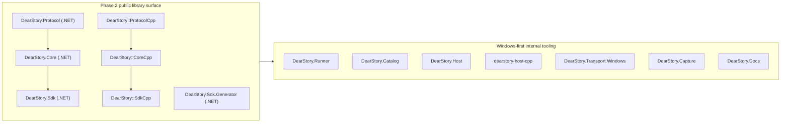

# DearStory Library Surface Productization Design

## Purpose

This design defines DearStory phase 2 as productization of the reusable
cross-language library surface before any broader runtime or platform
expansion. The immediate objective is to make DearStory genuinely consumable as
a library in native C++ and C# while preserving the existing Dear ImGui-first,
thin-SDK direction.

## Problem statement

The repository now proves a Windows-first vertical slice with real C++ and .NET
hosts, capture, static docs, and end-to-end verification. That work is useful,
but it does not yet establish DearStory as a reusable library product:

- the public package surface is still pre-1.0 and undocumented as a product;
- no .NET package metadata, local feed flow, or NuGet publication path exists;
- no installable/exported CMake package exists for C++ consumers;
- consumer proof is mostly repository-internal and not yet package-oriented;
- runtime/tooling concerns remain mixed conceptually with library concerns.

If phase 2 expands platform or runtime abstractions before productizing the
library surface, the project risks hardening internal implementation details
instead of hardening a consumer-facing API.

## Goals

1. Make DearStory consumable as a library in both C# and C++.
2. Keep the public SDKs thin: story authors still call Dear ImGui or ImGui.NET
   directly.
3. Separate package-safe library layers from Windows-first runner, transport,
   host, and catalog execution layers.
4. Add automated proof that an external consumer can install and use DearStory
   from packaged artifacts in both languages.
5. Prepare a release-quality path for .NET packages and versioned C++ install
   artifacts without broadening runtime scope prematurely.

## Non-goals

This phase does not include:

- Linux or macOS runtime implementation;
- replacing Windows-only runner or transport internals;
- a DearStory-owned widget abstraction;
- public publication of runner/catalog/Windows transport as stable products;
- package-manager support for every ecosystem at once;
- browser, remote, or embedded execution expansion.

## Constraints carried forward

- DearStory remains Dear ImGui-first and language-neutral.
- The C++ SDK and the C# SDK remain first-class surfaces.
- Public APIs require Doxygen or XML comments.
- Build/test/docs verification stays mandatory through `eng/build.ps1` and
  `eng/test.ps1`.
- Windows-first implementation does not justify Windows-specific assumptions in
  shared contracts or public library APIs.

## Approaches considered

### Option A — Library-first productization, runtime later

Package the reusable contracts and SDKs first:

- .NET: `DearStory.Protocol`, `DearStory.Core`, `DearStory.Sdk`,
  `DearStory.Sdk.Generator`
- C++: installable/exported `DearStory::ProtocolCpp`,
  `DearStory::CoreCpp`, `DearStory::SdkCpp`

Consumer proof comes from package/install based smoke tests. Windows runner,
hosts, transport, and catalog stay product-internal for now.

**Pros**

- hardens the API users actually code against;
- keeps C++ and C# equally first-class;
- reduces risk of Windows runtime details leaking into library contracts;
- creates a clean base for later platform-specific runtimes.

**Cons**

- does not by itself make the standalone tool distribution complete;
- requires package-boundary cleanup before broader feature work.

### Option B — Standalone tool productization first

Productize the Windows runner/catalog tool first and defer library packaging.

**Pros**

- improves the current demo path quickly;
- simplifies one Windows-centric user story.

**Cons**

- reinforces runtime-first coupling;
- leaves C++ and C# package consumption unresolved;
- does not satisfy the core requirement that DearStory be a usable library in
  both ecosystems.

### Option C — Platform-abstraction first

Refactor transports/hosts/runner toward cross-platform interfaces before
productization.

**Pros**

- advances the long-term portability story early.

**Cons**

- expands scope across multiple subsystems at once;
- hardens abstractions before consumer packaging is proven;
- delays the first truly reusable library deliverable.

## Decision

Choose **Option A**.

Phase 2 will productize the library surface first and explicitly treat the
Windows runner, host, transport, catalog, and capture layers as internal
tooling surfaces until library consumption is proven in both languages.

## Public surface for phase 2

### .NET packages

Phase 2 treats these as publishable packages:

| Package | Responsibility | Allowed dependencies |
| --- | --- | --- |
| `DearStory.Protocol` | generated and hand-authored control contract types | BCL only |
| `DearStory.Core` | story model, schema, session, deterministic services | `DearStory.Protocol` |
| `DearStory.Sdk` | thin authoring surface for story code | `DearStory.Core` |
| `DearStory.Sdk.Generator` | source generator/analyzer for registry generation | Roslyn packages only |

These remain non-packaged/internal in phase 2:

- `DearStory.Transport.Windows`
- `DearStory.Host`
- `DearStory.Runner`
- `DearStory.Catalog`
- `DearStory.Capture`
- `DearStory.Docs`
- `DearStory.CaptureWorker`

### C++ package surface

Phase 2 treats these installed/exported targets as public:

| CMake target | Responsibility |
| --- | --- |
| `DearStory::ProtocolCpp` | protocol contract and framing support intended for native integrations |
| `DearStory::CoreCpp` | story model, schema, session, deterministic services |
| `DearStory::SdkCpp` | thin authoring surface for native stories |

The initial distribution mechanism is an installable CMake package with config
and version files plus versioned archives attached to releases. vcpkg/Conan
integration remains backlog work until the install/export contract is stable.

## Architectural boundary



The dependency rule is one-way:

- internal tooling may depend on packaged libraries;
- packaged libraries may not depend on runner, host, transport, capture,
  catalog, or Windows-only APIs.

## Consumer proof strategy

Phase 2 must prove external-style consumption instead of only internal
references.

### C#

The repository will produce local `.nupkg` artifacts into a temporary or
repository-local feed and build a smoke consumer that references:

- `DearStory.Protocol`
- `DearStory.Core`
- `DearStory.Sdk`
- `DearStory.Sdk.Generator`

through `PackageReference`, not `ProjectReference`.

The smoke consumer must compile a real story using:

- `[Story]`
- `[StoryArg]`
- `StoryContext`
- generated registry output

### C++

The repository will install the native libraries to a local prefix and build a
smoke consumer through:

```cmake
find_package(DearStory CONFIG REQUIRED)
target_link_libraries(consumer PRIVATE DearStory::SdkCpp)
```

The smoke consumer must compile a real story registration using the installed
headers and exported targets rather than direct repository include paths.

## Versioning and release shape

Phase 2 will introduce one shared pre-1.0 version line, for example
`0.1.0-alpha.<build>`, applied consistently to:

- .NET package metadata;
- generated package documentation/readme metadata;
- CMake package version files;
- release artifact names.

For .NET, tagged release automation should be able to push packages to NuGet
once credentials are configured. For C++, the release automation should publish
installable archives and checksums; registry integration remains a later
follow-on.

## Documentation deliverables

Phase 2 must add product-facing docs, not only architecture docs:

- how to consume the .NET packages locally and from NuGet;
- how to consume the C++ CMake package from an external project;
- package/versioning policy;
- public API boundary between packaged libraries and Windows-first tooling;
- maintenance guidance for adding future public APIs without leaking runtime
  details.

## Verification requirements

Phase 2 is only complete when all of the following are true:

1. `eng/build.ps1` and `eng/test.ps1` remain green.
2. .NET pack succeeds for the public packages.
3. C++ install/export/config generation succeeds.
4. A .NET package-based smoke consumer builds and tests successfully.
5. A C++ installed-package smoke consumer configures, builds, and tests
   successfully.
6. Public API documentation generation stays green.
7. CI publishes package/install artifacts for inspection on every relevant
   branch and PR.

## Deferred backlog after phase 2

- public packaging of runner/catalog/Windows transport if still desirable;
- vcpkg or Conan distribution for the native packages;
- Linux and macOS runtime/tooling implementations against the same library
  contracts;
- richer compatibility/upgrade guidance once the public API leaves early
  pre-1.0 churn.
