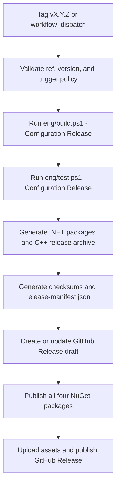

# DearStory Release Automation Design

## Purpose

This design defines DearStory phase 3 as release automation and productization
follow-through for the public library surface established in phase 2.

The immediate objective is to turn DearStory's validated package/install story
into a reproducible, auditable, real publication workflow for the coordinated
public C++ and C# library surface without broadening the runtime/platform
scope.

## Problem statement

Phase 2 made DearStory consumable as a library in both C++ and C#. The public
packages and targets now exist, package/install consumption is proven, and the
public boundary is protected from Windows-first runtime details.

That is not yet the same thing as having a release product:

- versioning is not yet driven by one canonical repository source;
- there is no single release pipeline that validates, packages, and publishes
  the public surface as one product unit;
- manual publication remains too easy to drift away from repository metadata,
  artifact naming, and documentation;
- failure handling for partial publication is not yet codified as a product
  policy;
- the repository can prove package consumption, but it cannot yet prove that a
  tagged or manually triggered release will publish the same coherent public
  surface every time.

If DearStory expands runtime or platform scope before this release path is
hardened, the project risks shipping public packages with inconsistent version
metadata, partial publication states, or process drift between C++ and C#.

## Goals

1. Create one canonical version source for the public DearStory product.
2. Publish the public DearStory library surface through one release pipeline.
3. Keep release publication atomic at the product level: the public release is
   not considered complete until all required .NET packages, the public C++
   artifact, checksums, and release manifest are present.
4. Support both automatic tagged releases and manually triggered releases while
   forcing both paths to match the version declared in the repository.
5. Preserve C++ and C# as first-class public targets in every release
   decision.
6. Reuse the canonical build/test/package proof before any external
   publication.

## Non-goals

This phase does not include:

- adding new public packages or public targets;
- productizing `Runner`, `Catalog`, `Host`, `Transport.Windows`, `Capture`, or
  `Docs`;
- Linux or macOS runtime expansion;
- split versioning per package;
- separate release pipelines per package or per language;
- code signing, symbol publication, or provenance attestation beyond the
  release manifest and checksums;
- trying to model cross-service publication as a true distributed transaction.

## Constraints carried forward

- DearStory remains Dear ImGui-first and language-neutral.
- DearStory must remain consumable as a library in both C++ and C#.
- The C++ SDK and the C# SDK remain first-class surfaces.
- Public package/library surfaces must not depend on Windows-first runtime
  tooling.
- `Runner`, `Catalog`, `Host`, `Transport.Windows`, `Capture`, and `Docs`
  remain internal unless a later phase explicitly productizes them.
- Build/test/docs verification remains mandatory through:
  - `pwsh -NoProfile -File .\eng\build.ps1 ...`
  - `pwsh -NoProfile -File .\eng\test.ps1 ...`
- Real publication in this phase uses stable SemVer tags of the form
  `vX.Y.Z`.
- Release publication is atomic at the product level, not per-package.

## Approaches considered

### Option A - single release pipeline with repository-owned version source

Create one repository version file, derive all public version metadata from it,
run one release workflow for both languages, and publish only after the full
verification and packaging set has succeeded.

**Pros**

- keeps C++ and C# coordinated as one public product;
- gives PR-reviewed, reproducible version changes;
- minimizes drift between .NET, CMake, artifacts, and docs;
- makes partial publication states explicit and easier to detect;
- matches the current phase-2 product boundary.

**Cons**

- requires plumbing version derivation into multiple build surfaces;
- makes release policy stricter than ad hoc manual publication.

### Option B - tag-only version source

Treat the git tag as the only release authority and derive the rest from the
tag event.

**Pros**

- simple trigger story;
- no extra repository file.

**Cons**

- weak local and PR validation story;
- no canonical version value in the repository before tagging;
- increases risk of drift between repo metadata and release automation.

### Option C - split workflows or split versions per package

Allow packages or languages to release independently.

**Pros**

- more operational flexibility;
- easier to rerun one publish path in isolation.

**Cons**

- contradicts the requirement that C++ and C# remain coordinated public
  surfaces;
- increases compatibility and documentation complexity;
- invites partial product releases and version skew.

## Decision

Choose **Option A**.

Phase 3 will introduce one repository-owned version file and one coordinated
release pipeline for the existing public DearStory library surface.

## Public release unit

Every public release in phase 3 is atomic at the product level and includes all
of the following:

- `DearStory.Protocol`
- `DearStory.Core`
- `DearStory.Sdk`
- `DearStory.Sdk.Generator`
- one public C++ package archive for the currently supported published
  toolchain/platform
- `SHA256SUMS`
- `release-manifest.json`
- one GitHub Release representing that exact product unit

No release in this phase is considered complete if only a subset of those
artifacts is published.

## Canonical version source

Phase 3 introduces `eng/version.json` as the single source of truth for the
public product version.

Initial structure:

```json
{
  "version": "0.2.0"
}
```

Rules:

- the file is committed and reviewed like any other product change;
- the declared version is stable SemVer for real publication in this phase;
- no workflow input or script argument may override this value;
- workflows may validate against it, but never replace it;
- .NET package version, CMake package version, artifact names, and release
  manifest contents all derive from this file.

## Release triggers

Phase 3 supports exactly two release entrypoints:

1. automatic release from a tag named `vX.Y.Z`;
2. manual release through `workflow_dispatch` with `ref` and `version` inputs.

Validation rules:

- tagged release: `tag == "v" + eng/version.json.version`
- manual release: `input version == eng/version.json.version`
- manual release: the resolved commit must be reachable from `origin/main`

Any mismatch fails the workflow before external publication begins.

## Repository structure

Phase 3 adds or updates these release-facing surfaces:

- `eng/version.json`
  - canonical public version source
- `eng/read-version.ps1`
  - reads and validates `eng/version.json`
- `eng/release.ps1`
  - orchestrates build, verification, packaging, checksums, and manifest
    generation
- `eng/generate-release-manifest.ps1`
  - writes a deterministic machine-readable release manifest
- `.github/workflows/release.yml`
  - single publish workflow for tag and manual release paths
- `.github/workflows/ci.yml`
  - reuses the same packaging and verification logic without publishing
- `Directory.Build.props`
  - consumes version data derived from `eng/version.json` instead of acting as
    a second version authority
- `CMakeLists.txt`
  - consumes the same canonical version source for public package metadata

Release output layout:

```text
artifacts/releases/0.2.0/
  dotnet/
    DearStory.Protocol.0.2.0.nupkg
    DearStory.Core.0.2.0.nupkg
    DearStory.Sdk.0.2.0.nupkg
    DearStory.Sdk.Generator.0.2.0.nupkg
  cpp/
    DearStory-cpp-0.2.0-windows-msvc-x64.zip
  SHA256SUMS
  release-manifest.json
```

## Release workflow architecture



The release workflow is intentionally linear. It favors determinism and clear
failure points over parallel publication complexity.

## Release flow

### Validation stage

The workflow resolves the exact commit to release and then:

- reads `eng/version.json`;
- validates stable SemVer formatting;
- validates tag-to-version or manual-input-to-version equality;
- validates manual `ref` ancestry from `origin/main`;
- fails immediately if any policy check does not hold.

### Verification stage

Before any external publication, the workflow must:

- run `pwsh -NoProfile -File .\eng\build.ps1 -Configuration Release`;
- run `pwsh -NoProfile -File .\eng\test.ps1 -Configuration Release`;
- generate the public `.nupkg` set;
- generate the public C++ archive from the installed package tree;
- generate `SHA256SUMS`;
- generate `release-manifest.json`.

### Publication stage

Publication order is:

1. create or reuse a GitHub Release in `draft`;
2. upload the public C++ archive, checksums, release manifest, and any
   inspection assets required by policy;
3. publish the NuGet packages in dependency order:
   - `DearStory.Protocol`
   - `DearStory.Core`
   - `DearStory.Sdk`
   - `DearStory.Sdk.Generator`
4. verify that the full NuGet set succeeded;
5. publish the GitHub Release by moving it out of `draft`.

This order creates operational atomicity: the public GitHub release never
becomes final before the package set is complete.

## Failure handling and idempotence

Phase 3 treats release failure as a first-class product concern.

### Principles

- build, test, package, boundary checks, checksums, and manifest generation all
  happen before external publication;
- a public release must never appear complete when the underlying package set
  is incomplete;
- rerunning the same release should be safe when the external state is still
  coherent.

### Idempotence rules

- local release artifacts may be regenerated for the same commit and version;
- `SHA256SUMS` and `release-manifest.json` must be deterministic;
- GitHub draft assets may be reused if the same file already exists with the
  same content;
- if an existing asset has the same name but different content, the workflow
  fails;
- the publish step checks whether each target NuGet package/version already
  exists;
- if the full expected NuGet set already exists, the workflow may treat that
  part as complete;
- if only part of the NuGet set exists, the workflow fails and leaves the
  GitHub Release in `draft`.

### Failure policy

- validation failure: stop before build, publish nothing;
- verification failure: stop before publish, publish nothing;
- GitHub draft creation failure: stop before NuGet publication;
- partial NuGet publication failure: stop immediately, keep GitHub Release in
  `draft`, and surface the incomplete state explicitly;
- post-NuGet/pre-finalization failure: keep GitHub Release in `draft` and
  allow a targeted rerun to complete finalization without version drift.

This is not a distributed transaction across NuGet and GitHub. The design goal
is operational atomicity and explicit incomplete-state handling.

## Credentials and permissions

Phase 3 uses one protected release environment for irreversible publication
steps.

- release environment: `release`
- required secret: `NUGET_API_KEY`
- GitHub publication uses the workflow `GITHUB_TOKEN`
- workflow-level permissions default to `contents: read`
- only the final publish job elevates to `contents: write`

Non-publish jobs do not receive release secrets.

## Verification requirements

Phase 3 is only complete when all of the following are true:

1. `eng/version.json` exists and is the only public version source.
2. .NET package metadata derives from that source.
3. CMake public package metadata derives from that source.
4. Public artifact names derive from that source.
5. `release-manifest.json` derives from the actual release outputs.
6. CI can generate the full release unit without publishing it externally.
7. `release.yml` supports both tag-triggered and manual releases.
8. Both release entrypoints block if the repository version does not match the
   trigger.
9. Manual release blocks if the selected commit is not reachable from
   `origin/main`.
10. The release workflow publishes all four public NuGet packages and the
    public C++ artifact as one product unit.
11. GitHub Release publication remains `draft` until the package set is
    complete.
12. Partial publication is detected and surfaced as an incomplete release
    rather than treated as success.
13. Public package boundary verification still rejects dependencies on
    `Runner`, `Catalog`, `Host`, `Transport.Windows`, `Capture`, and `Docs`.

## Deferred backlog after phase 3

- cryptographic signing of packages and archives;
- richer release provenance or SBOM publication;
- non-Windows release-grade packaging for the public C++ surface;
- registry/package-manager integrations beyond NuGet and release archives;
- any broader runtime or platform expansion beyond the current public package
  boundary.
